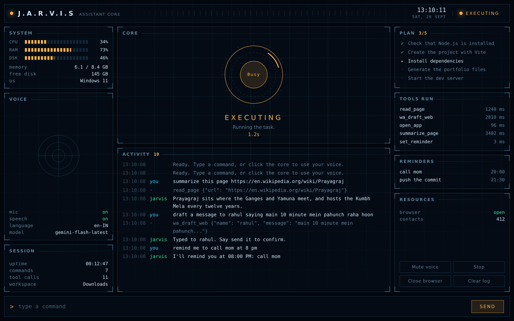

# JARVIS

A voice-controlled desktop assistant for Windows. Say "Hey Jarvis" and then
what you want. It opens applications, manages files, writes and edits code in
VS Code, runs terminal commands, browses and reads web pages, sends WhatsApp
messages, sets reminders and reads your screen.

> Replace `USERNAME` in the badge above with your GitHub username.

## What makes it different from a wrapper around an API

**Simple commands never reach the model.** A local intent router handles
"open Chrome", "what's the time", "remind me at 8 pm" and about thirty other
patterns in milliseconds, with no network call. The model is reserved for
requests that need thought, which keeps the assistant usable on a free-tier
quota and makes common commands feel instant.

**Nothing destructive happens without a yes.** Every file path is resolved
inside one configured workspace and anything outside it is refused. Deleting,
running shell commands, sending a message, or clicking a button whose label
reads like pay, buy, submit or delete each raise a confirmation the user has
to answer. Overwriting a file keeps a `.bak` copy first.

**Multi-part requests are planned, not improvised.** "Create a React portfolio
and run it" is broken into an ordered list of steps, shown in the Plan panel,
and worked through one at a time with shared context. If a step fails, the run
stops there and says which step and why, instead of continuing through steps
that depended on it.

**Every reading on the panel is real.** CPU, memory and disk come from psutil;
the tool timings are measured; the reminders and contact counts are read from
the store. There is no decorative telemetry.

## Architecture

Seven packages, each with one job. Nothing in `tools/` knows the model
exists; nothing in `ai/` knows what a file is. The registry is the only
place the two meet.

    launcher_web.py        the panel (pywebview); launcher.py is a plain Tk fallback
    ui/                    the panel and the job dashboard, plain HTML
    jarvis/
      app/
        config.py          paths and .env settings, read once at import
        assistant.py       the loop: wake word, routing, speech in and out
        stats.py           the live readings the panel shows
      voice/
        listening.py       microphone, room calibration, recogniser
        speaking.py        neural voice, with the local one as fallback
        wake.py            hearing its own name, loosely enough to work
      routing/
        router.py          the fast lane; these commands never reach the model
      ai/
        provider.py        one door to Gemini: retries, fallback, error wording
        brain.py           conversation history and the tool-calling loop
        planner.py         multi-part requests, broken into steps
        prompts.py         everything JARVIS is told about itself
      tools/
        registry.py        the 65 tools and how they are described to the model
        permissions.py     the confirmation gate
        workspace.py       the filesystem fence
        files.py  system.py  apps.py  browser.py
        whatsapp.py  whatsapp_web.py  contacts.py
        reminders.py  screen.py
      store/
        memory.py          profile, preferences, contacts, history
      jobs/
        resume.py          a resume (PDF, Word, image) into a candidate profile
        sources.py         public job APIs, and search links for the rest
        matching.py        the 0-100 score, component by component
        store.py           SQLite: jobs, applications, audit trail
        engine.py          the pipeline and what JARVIS says about it
        apply.py           fills a form, never submits one
        dashboard.py       the local dashboard server
    tests/                 121 tests, no network or sound card needed

Three rules hold the shape:

- A tool module exposes plain functions and imports nothing from `ai/`.
  `registry.py` is where they get names and schemas, so adding a tool
  touches one file.
- Everything that could do damage goes through `permissions.confirm` and
  `workspace.safe_path`. Two functions, two places to audit.
- `provider.py` is the only file that knows the model's HTTP shape, so
  swapping providers is one file, not a search across the codebase.

A command travels: voice → wake word → router → planner or model → tools → speech.

## How it sounds

Speech out has two engines. The default uses Microsoft's neural voices
through `edge-tts` — Indian English, Hindi and others, and it sounds like a
person. It needs a network connection. Without it, or without the package,
JARVIS falls back silently to the Windows voice, picking the best one
installed rather than the default robotic one.

    what voice are you using

prints the current engine and the voices available. Change it in `.env`:

    JARVIS_VOICE=en-IN-NeerjaNeural
    JARVIS_VOICE_SPEED=+8%

`edge-tts --list-voices` shows all several hundred. Setting
`JARVIS_NEURAL_VOICE=false` forces the local engine, which works offline.

## When it mishears you

Every phrase it makes out but doesn't act on is written to the activity log
as `heard: ...`. That one line separates "the mic is dead" from "it hears me
but not my name", which are different problems with different fixes.

The wake word is matched loosely, so "jervis" and "javas" still wake it while
"service" and "harvest" don't. Tighten or loosen with `JARVIS_WAKE_FUZZY`.

    list microphones      the input devices and their numbers
    recalibrate mic       re-learn the room's background noise

If it keeps missing you, in order: run `recalibrate mic`; raise
`JARVIS_PAUSE` to 1.4 if it cuts you off mid-sentence; pick a different
device with `JARVIS_MIC`; and if the room is noisy, set a fixed floor with
`JARVIS_MIC_SENSITIVITY=300` so it stops chasing the noise.

## Job hunter

JARVIS can read your resume, search job boards, score every result against
your actual skills and keep track of what you applied to.

    scan my resume resume.pdf
    set roles to software developer, full stack developer
    set countries to india, worldwide
    find jobs for me
    show my top matches
    why job 1
    which skills am I missing
    open my dashboard

The dashboard is at **http://localhost:3000/jobs** — job cards with match
scores and skill gaps, an application feed, and analytics showing which
skills keep coming up that your resume doesn't list.

### How the score works

It is arithmetic, not an opinion, so "why did you pick this one?" always has
a real answer. Out of 100: skills 45, job title 20, location and work mode
15, experience bar 10, education 5, projects 5. `why job 1` prints the
breakdown line by line.

Three rules override the total, because a high score on a job you cannot
get is worse than no score at all:

- **Out of reach** — a senior title, or a years bar far above you: capped at 45.
- **Out of country** — "remote" usually means remote *within a named set of
  countries*. A listing open only to the USA is capped at 25 for someone in
  Prayagraj. Set yours with `set countries to india, worldwide`; with nothing
  set, the country in your resume's address is used.
- **Out of field** — a posting naming no technology at all, with nothing of
  yours matching, is capped at 30. A search for "software developer" returns
  sales and writing roles, and they should not sit near the top just because
  nothing contradicted them.

### What it will not do

**It does not submit applications.** `prepare application 1` opens the
posting and fills the fields your resume can answer, then stops. You check
the form and press submit. Three reasons: LinkedIn, Naukri and Indeed all
forbid automated submission in their terms; an answer JARVIS guessed would
be a claim made in your name; and an application cannot be taken back.

**It does not invent answers.** Salary expectations, notice period, visa
status, cover letters, demographic questions — JARVIS spots these on the
form and tells you it is leaving them alone.

**It does not scrape.** Jobs come from Adzuna, Jobicy, The Muse, Remotive,
RemoteOK and Arbeitnow, which publish APIs for this. Only Adzuna needs a key,
and it is the one that covers Indian listings properly; the rest work
straight away. `JARVIS_JOB_GEO` and `JARVIS_JOB_CITY` tell the boards that
can filter by place where to look. LinkedIn, Naukri, Indeed and Internshala have no open
API and forbid scraping, so `open linkedin` builds the search URL and opens
it for you to browse yourself.

**It does not record an application you didn't make.** The database only
says APPLIED when you say `mark 1 as applied`.

## Setup

1. Python 3.12 and VS Code with the `code` command on PATH.
2. `py -3.12 -m venv .venv` then `.\.venv\Scripts\Activate.ps1`
3. `pip install -r requirements.txt`
4. `python -m playwright install chromium` — optional; without it the browser
   tools fall back to the Chrome or Edge already installed.
5. Copy `.env.example` to `.env`, add a key from aistudio.google.com, and set
   `JARVIS_WORKSPACE` to the folder JARVIS is allowed to touch.
6. `python launcher_web.py`

For a desktop shortcut: `powershell -ExecutionPolicy Bypass -File make_shortcut.ps1`

## Tests

    pip install -r requirements-dev.txt
    python -m pytest

109 tests covering the workspace sandbox, the confirmation gate, the intent
router in English and Hinglish, contact-file parsing, the planner's step
sequencing and failure handling, the job match scoring and deduplication,
the guards that stop an application being recorded that was never made, and
the tool registry. None of them need a
network connection, a microphone or an API key.

## Commands

Applications: open Chrome, open VS Code, close Spotify, chrome kholo,
spotify band karo.

Browsing: summarize this page https://..., read this page, look up Python
internships in Prayagraj, what's the price on this page, click Sign in,
fill Email with my address.

WhatsApp: open WhatsApp Web, list my contacts, message Rahul saying I'm
reaching in ten minutes, send it. Bulk-load numbers with
`import contacts from contacts.csv`.

Files and code: create a folder called Projects, find all Python files,
search my project for the login function, summarize this PDF, run the tests
and fix what fails.

Screen: look at my screen, what error is showing.

Reminders and memory: remind me to call mom at 8 pm, list reminders,
remember that my project folder is D:/dev, what do you remember.

## Configuration

| Variable | Meaning |
| --- | --- |
| `GEMINI_API_KEY` | Key from aistudio.google.com |
| `JARVIS_WORKSPACE` | The only folder JARVIS may read or write |
| `GEMINI_MODEL` | Defaults to `gemini-flash-latest` |
| `JARVIS_WAKE` | Wake words, comma separated |
| `JARVIS_LANG` | Speech recognition language, default `en-IN` |
| `JARVIS_BROWSER_HEADLESS` | `true` hides the automation browser |
| `ADZUNA_APP_ID` / `ADZUNA_APP_KEY` | Free key from developer.adzuna.com, for Indian listings |
| `JARVIS_JOB_GEO` | Country for boards that filter by region, default `india` |
| `JARVIS_JOB_CITY` | City for boards that filter by city |

## Known limitations

Ctrl+Space works when the window has focus, not system-wide. Speech
recognition needs a network connection, since it uses Google's service.
WhatsApp Desktop sending presses Enter through pyautogui, so the chat window
must stay in front. Job search covers only the boards with public APIs;
LinkedIn, Naukri and Internshala are opened for manual browsing. Resume OCR
for a photographed resume needs Tesseract installed, or falls back to the
model's vision. WhatsApp Web automation depends on that site's markup and
may need its selectors updated. Pages behind a captcha will not load.

## Licence

MIT
